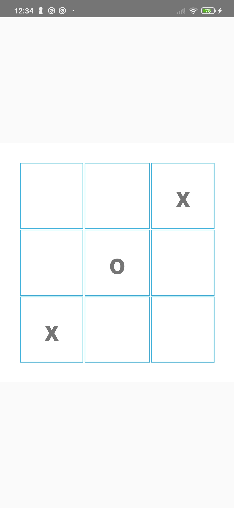
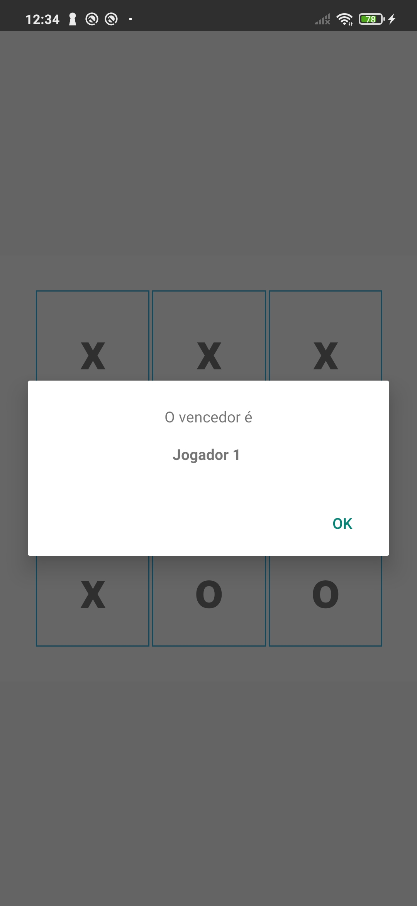
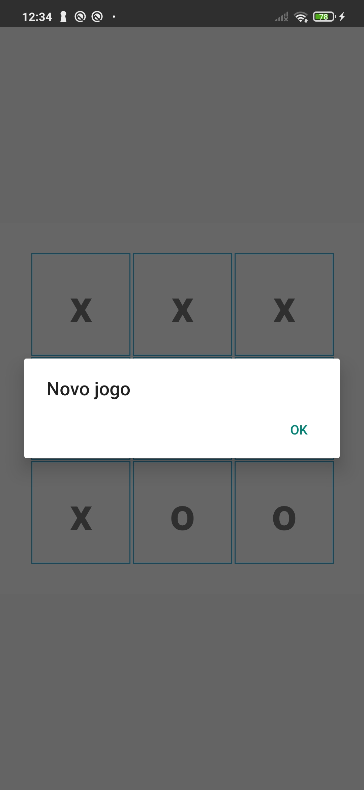

    <h1 align="center">Jogo da velha</h1>

## 🌟 Sobre

Um aplicativo do popular Jogo da velha construido com Kotlin

## 👨‍💻 Tecnologias utilizadas

## ✨ Screenshots

 

## 🚀 Introdução

Essas instruções fornecerão uma cópia do projeto em funcionamento em sua máquina local para fins de desenvolvimento e teste.

### Pré -requisitos

- Android Studio
- Java JDK

## 🔨 Construa e execute o aplicativo

Siga essas etapas para obter o projeto de trabalho!
`` `

1. Clone este repositório ou faça o download do arquivo
2. Extrair ZIP se baixado o código
3. Projeto aberto no Android Studio
4. Aguarde enquanto o Android Studio Download gradle ou os arquivos necessários
5. Pressione o botão Executar!
   `` `
